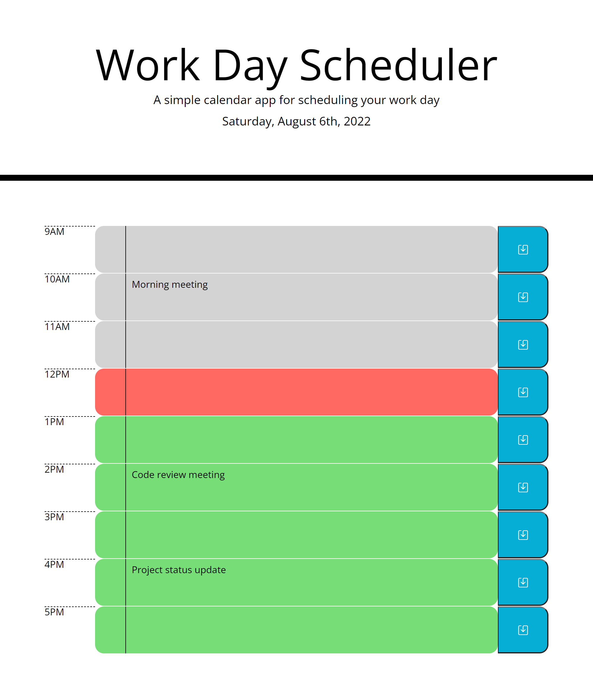

# work-day-scheduler

The contents of this repository are a Work Day Scheduler application for a standard 9AM to 5PM business day. Each hour timeblock contains a text box that can be edited to describe the task/event during that time. Clicking the save button will save the text contents to local storage. When the page is refreshed, any data from local storage will be loaded into the appropriate box. The current hour time block is highlighted red. Previous time blocks are gray. Future time blocks are green.

The deployed application can be found at: [alextheordinary.github.io/work-day-scheduler/](https://alextheordinary.github.io/work-day-scheduler/)

This is the screenshot of the completed application:

)